# AWS Lambda + S3 실습 기록 (정리본)

> **주의:** 본 문서의 계정 ID, 사용자명, 액세스 키 등 민감정보는 모두 **마스킹** 처리했습니다.

---

## 1) IAM 사용자 조회 오류

### 오류 내용
```text
An error occurred (AccessDenied) when calling the ListUsers operation: User: arn:aws:iam::<ACCOUNT_ID>:user/<IAM_USER> is not authorized to perform: iam:ListUsers on resource: arn:aws:iam::<ACCOUNT_ID>:user/ because no identity-based policy allows the iam:ListUsers action
```

### 권한 수 초과로 사용자 그룹 지정 후 재실행
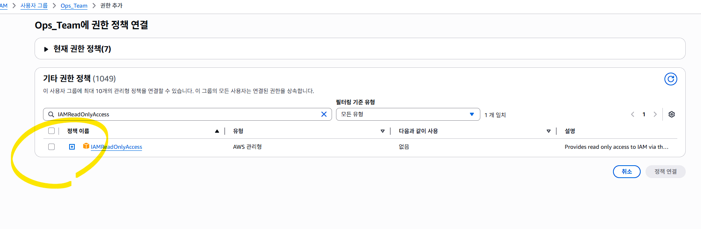
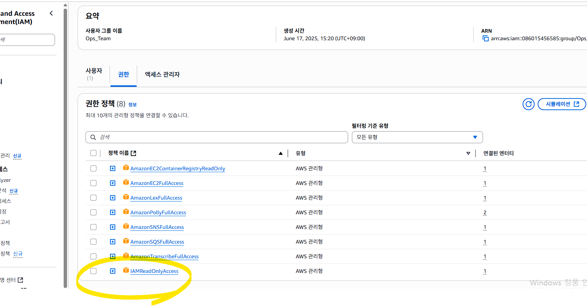

### 재실행 결과 (마스킹)
```json
{
  "Users": [
    {
      "Path": "/",
      "UserName": "<IAM_USER>",
      "UserId": "<IAM_USER_ID>",
      "Arn": "arn:aws:iam::<ACCOUNT_ID>:user/<IAM_USER>",
      "CreateDate": "2025-06-17T06:24:01+00:00"
    }
  ]
}
```

### 사용자 액세스 로그 (콘솔)
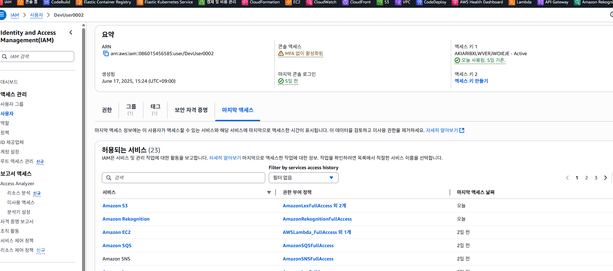

---

## 2) 참고 AWS CLI 명령
```bash
aws ec2 describe-instances   # EC2 인스턴스 목록
```

### 로컬 인증 정보 경로
```text
C:\Users\<USER>\.aws
```
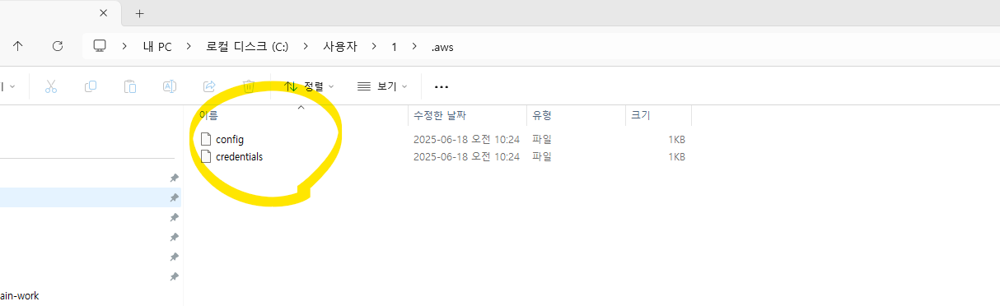

---

## 3) AWS Lambda 예제 흐름

### 전체 구성 흐름
1. S3 버킷 생성 (또는 기존 버킷 사용)
2. Lambda 함수 생성 (Node.js 코드)
3. Lambda에 필요한 IAM 역할 부여 (S3 접근 권한)
4. S3 이벤트 트리거로 Lambda 연결
5. `face1.png` 업로드 → Lambda 자동 실행 확인

---

## 4) Lambda용 IAM 역할 생성 및 연결

### 1단계: IAM 역할 생성
- AWS 콘솔 → IAM → 역할(Roles) → 역할 생성(Create role)
- **신뢰할 수 있는 엔터티 유형:** AWS 서비스
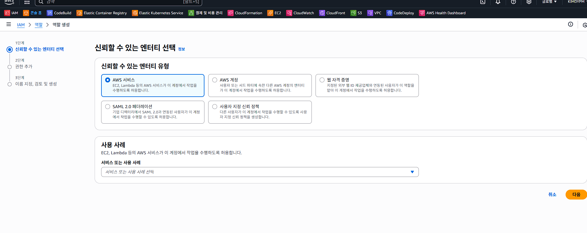
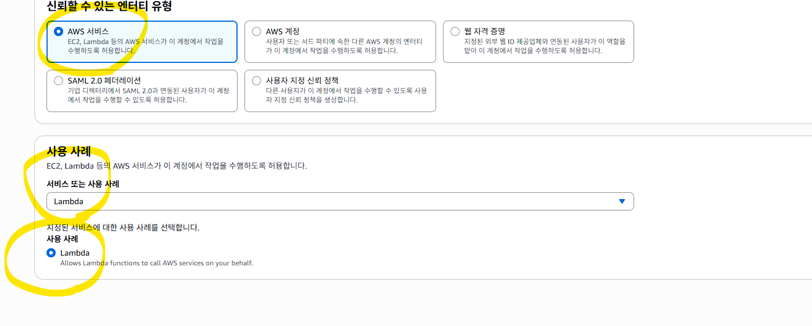

### 2단계: 사용 사례 선택
- **사용 사례:** Lambda → 다음

### 3단계: 권한 및 정책 연결
- 필요한 권한: S3 읽기 (GetObject 등)
- 기본 정책: `AmazonS3ReadOnlyAccess`
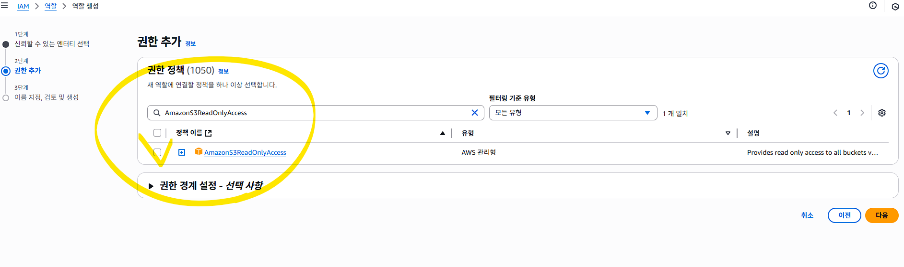

### 역할 세부 정보 입력
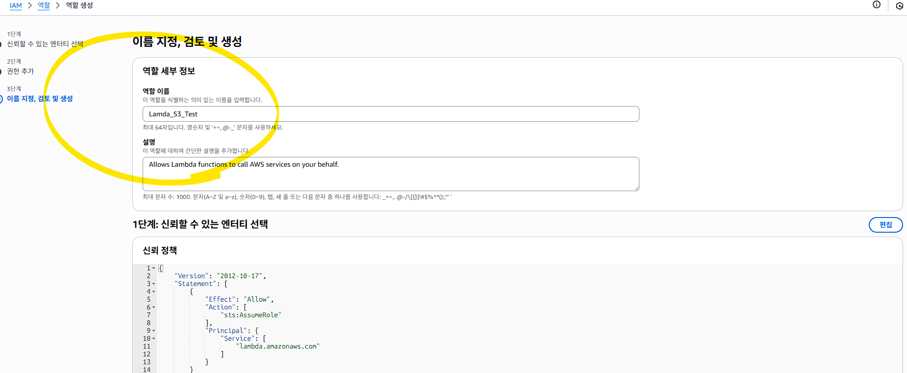

### 신뢰 정책 핵심 부분
```json
"Action": [
  "sts:AssumeRole"
],
"Principal": {
  "Service": [
    "lambda.amazonaws.com"
  ]
}
```

### 결과 확인
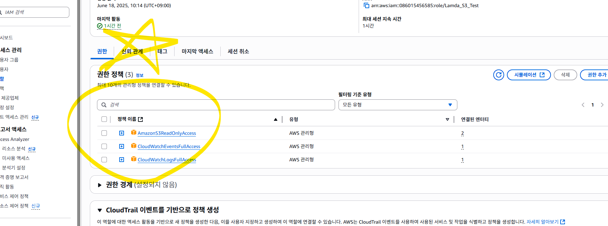
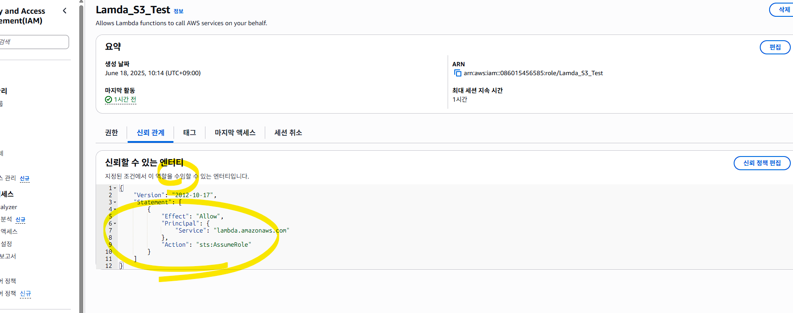

### 역할 목록에서 확인 (예: `Lamda_S3_Test`)
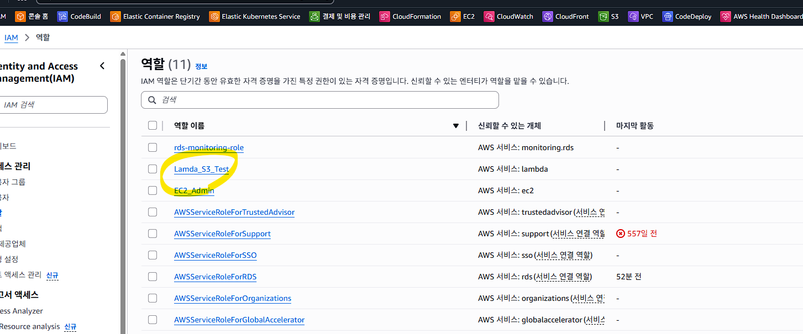

> **설명:**
> - `sts:AssumeRole`은 Lambda 서비스가 이 역할을 임시로 위임받아 사용함을 의미
> - `Principal: lambda.amazonaws.com` → Lambda 서비스만 이 역할을 사용할 수 있음

---

## 5) IAM User 권한 보완

### Lambda Full Access 부여
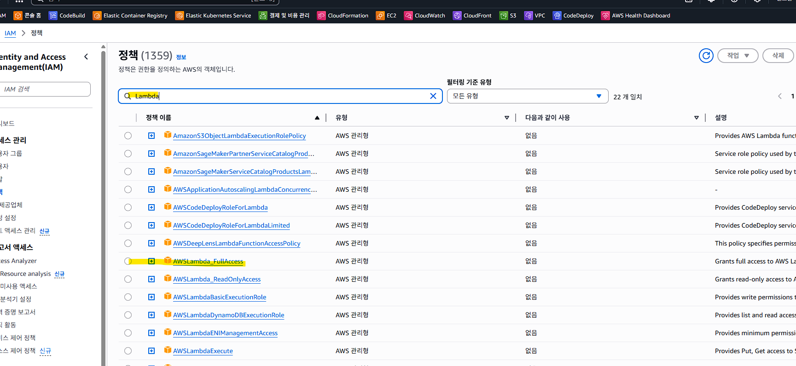
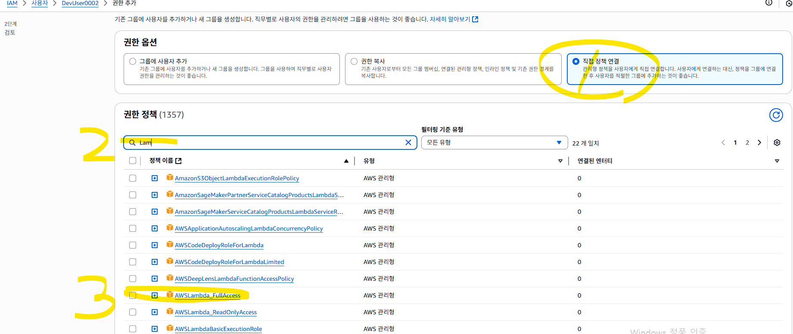

### 현재 권한/정책 확인
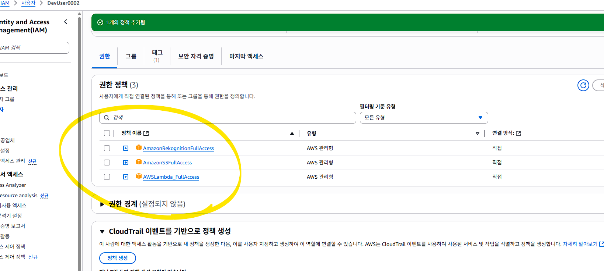

### `lambda:CreateFunction` 오류 시 사용자 정의 정책 생성
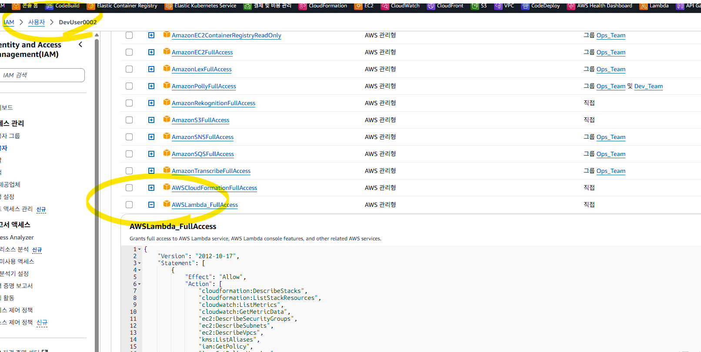
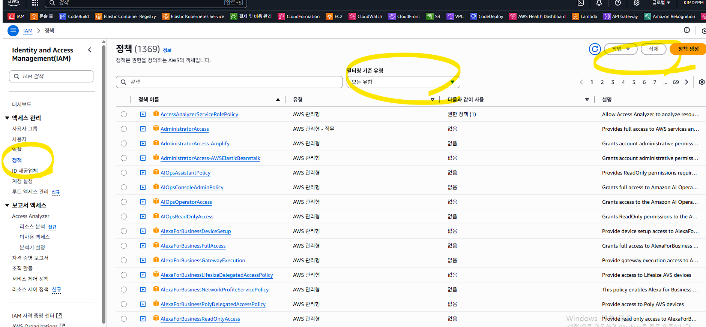
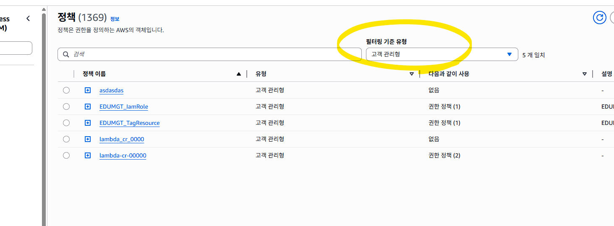
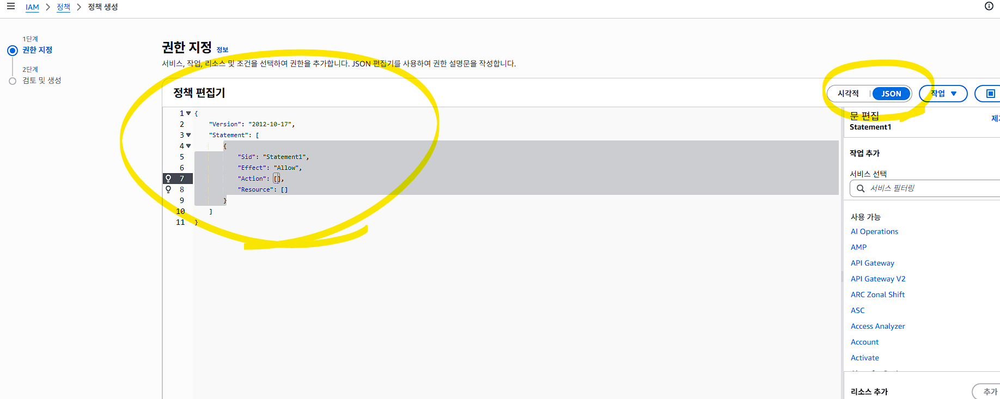

#### 정책 JSON 직접 입력
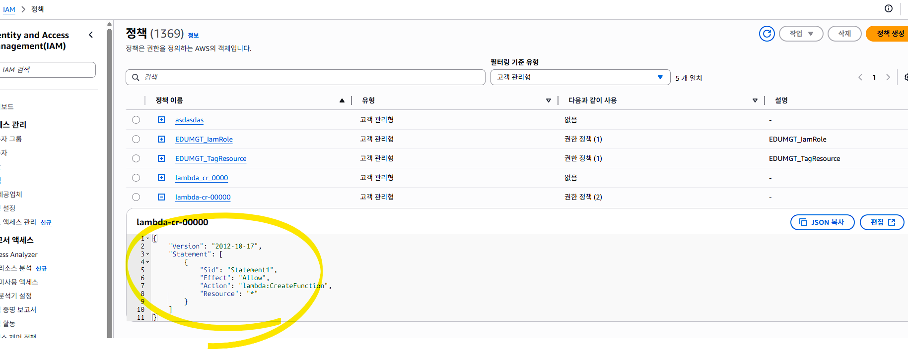

---

## 6) AWS CLI 인증 설정

### `aws configure`
```text
PS C:\edumgt-java-education\AWS_Lambda_Edu> aws configure
AWS Access Key ID [****************REDACTED]: 본인 키 복붙
AWS Secret Access Key [****************REDACTED]: 본인 키 복붙
Default region name [ap-northeast-2]:
Default output format [json]:
```

### `aws sts get-caller-identity`
```json
{
  "UserId": "<IAM_USER_ID>",
  "Account": "<ACCOUNT_ID>",
  "Arn": "arn:aws:iam::<ACCOUNT_ID>:user/<IAM_USER>"
}
```

> 인증 문제는 **여러 사용자 인증**, **장기간 미사용** 등에서 자주 발생합니다.

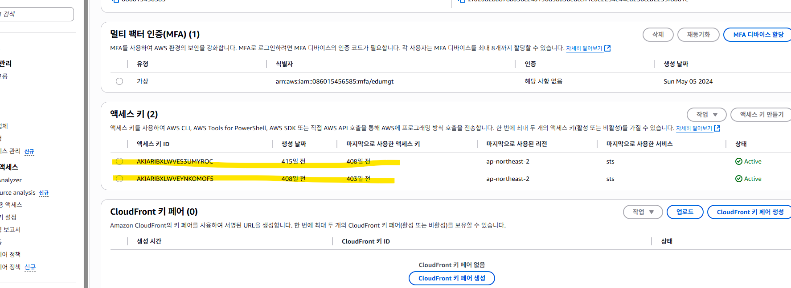

---

## 7) Lambda 함수 목록 확인
```bash
aws lambda list-functions --region ap-northeast-2
```
