# AWS CLI 설치 및 Lambda 생성 (정리본)

> **주의:** 계정 ID/ARN 등 민감정보는 마스킹 처리했습니다.

---

## 1) Codespace에서 AWS CLI 설치

### 설치
```bash
curl "https://awscli.amazonaws.com/awscli-exe-linux-x86_64.zip" -o "awscliv2.zip"
```

### 설치 확인
```bash
aws --version
# 예: aws-cli/2.27.40 Python/3.13.4 Linux/6.8.0-1027-azure exe/x86_64.ubuntu.24
```

### 필요 시 수동 설치
```bash
sudo ./aws/install
```

---

## 2) AWS SDK v2 경고
```
NOTE: The AWS SDK for JavaScript (v2) is in maintenance mode.
```
- **설명:** AWS SDK v2는 유지보수 모드 (보안 패치 중심)
- **권장:** AWS SDK v3로 마이그레이션

### v3 설치
```bash
npm install @aws-sdk/client-s3
```

---

## 3) Lambda 함수 만들기

### Windows PowerShell에서 ZIP 생성
```powershell
Compress-Archive -Path index.js -DestinationPath function.zip
```
- 부가 JSON은 제외하고 **연동 JS만 포함**

### 함수 등록
```bash
aws lambda create-function \
  --function-name edumgt-lambda-function \
  --runtime nodejs20.x \
  --role arn:aws:iam::<ACCOUNT_ID>:role/Lamda_S3_Test \
  --handler index.handler \
  --zip-file fileb://function.zip \
  --region ap-northeast-2
```

#### 옵션 설명
| 항목 | 설명 |
| --- | --- |
| `aws lambda create-function` | Lambda 함수 생성 명령 |
| `--function-name edumgt-lambda-function` | 생성할 Lambda 함수 이름 |
| `--runtime nodejs20.x` | 런타임 버전 |
| `--role arn:aws:iam::<ACCOUNT_ID>:role/Lamda_S3_Test` | 실행 역할 (필수 권한 포함) |
| `--handler index.handler` | Lambda 진입점 함수 |
| `--zip-file fileb://function.zip` | 배포 ZIP 경로 |
| `--region ap-northeast-2` | 리전 (서울) |

> `--role` 값은 **사람 계정 사용자처럼 역할을 부여**하는 개념으로, Lambda가 해당 역할의 권한으로 S3에 접근 가능해집니다.

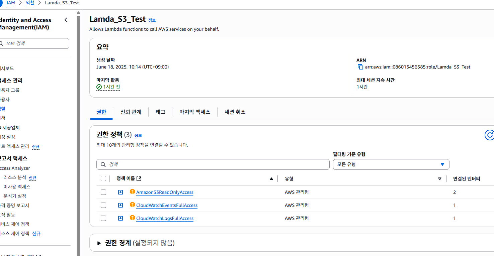
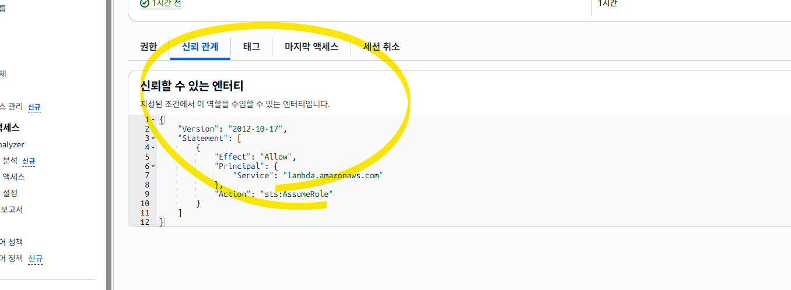

---

## 4) 생성 결과 예시
```json
{
  "FunctionName": "edumgt-lambda-function",
  "FunctionArn": "arn:aws:lambda:ap-northeast-2:<ACCOUNT_ID>:function:edumgt-lambda-function",
  "Runtime": "nodejs20.x",
  "Role": "arn:aws:iam::<ACCOUNT_ID>:role/Lamda_S3_Test",
  "Handler": "index.handler"
}
```

---

## 5) 동일 이름 함수 존재 시
```text
An error occurred (ResourceConflictException) when calling the CreateFunction operation: Function already exist: edumgt-lambda-function
```

---

## 6) 콘솔 확인
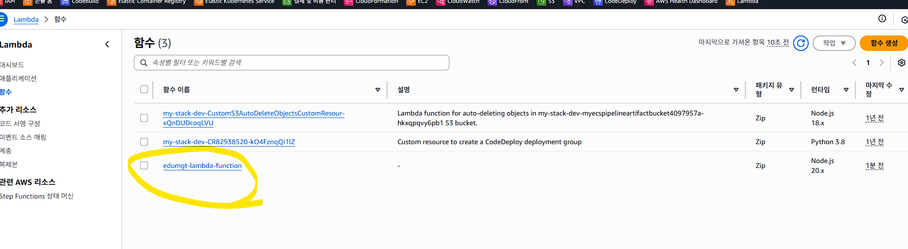
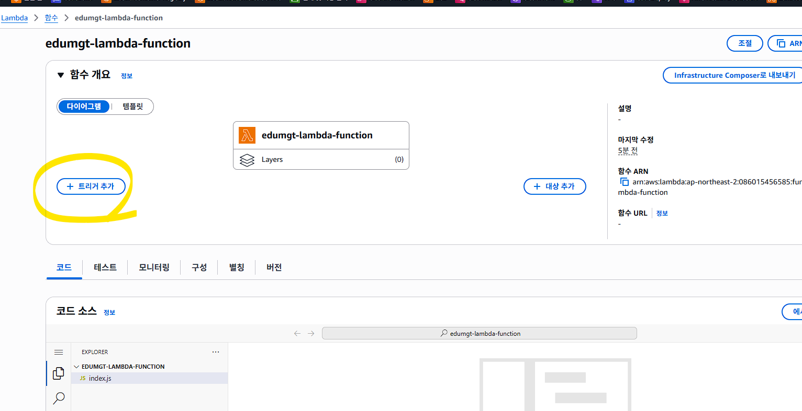

---

## 7) S3 이벤트 알림 등록
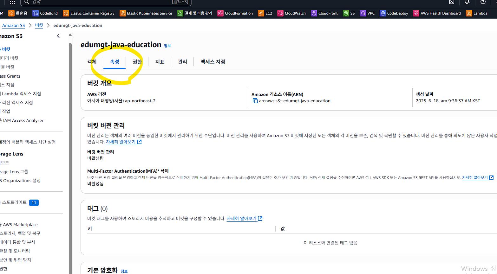
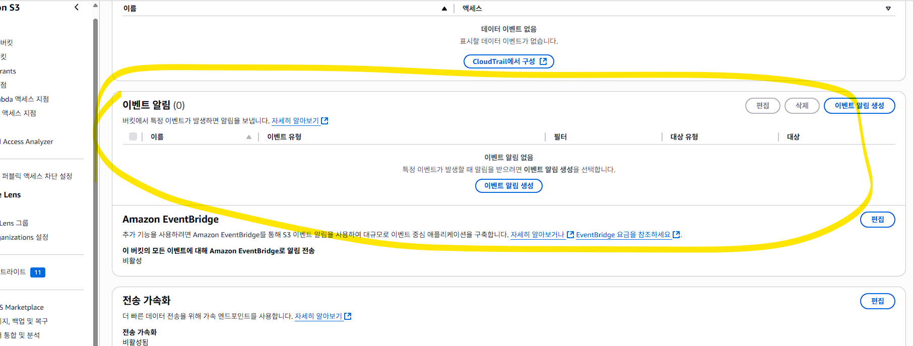
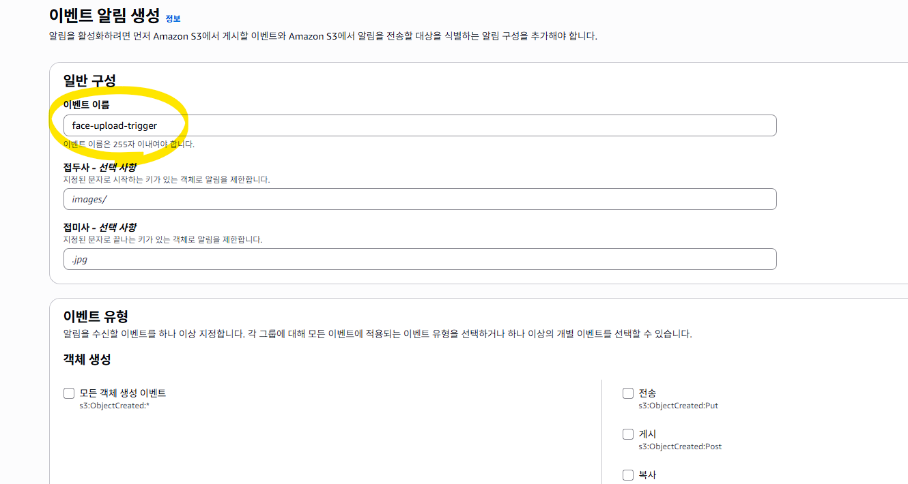
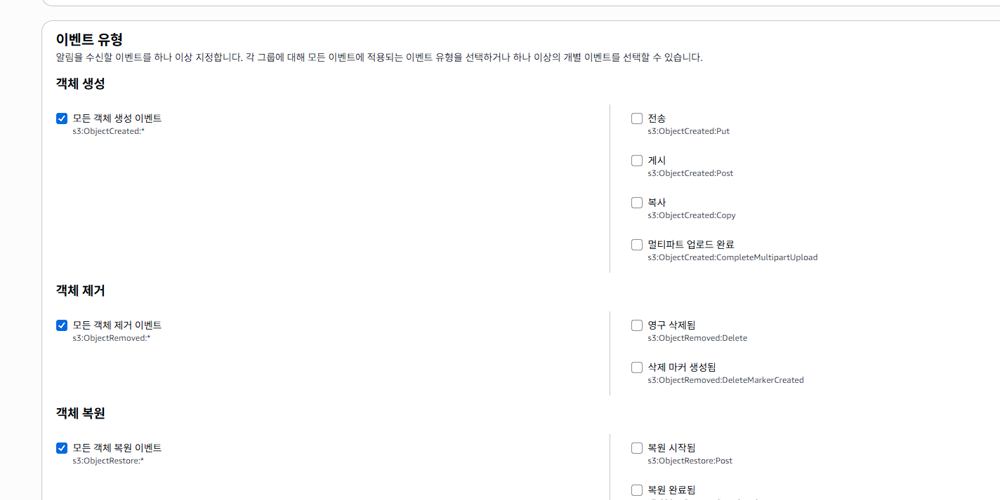

### 하단의 Lambda 선택
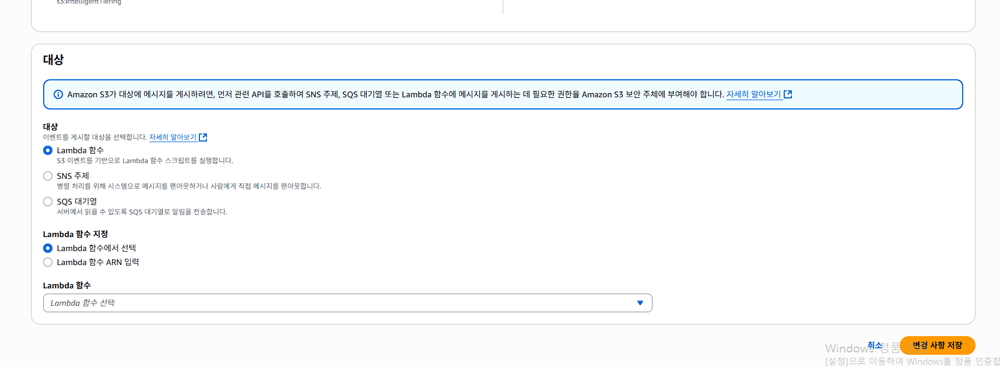
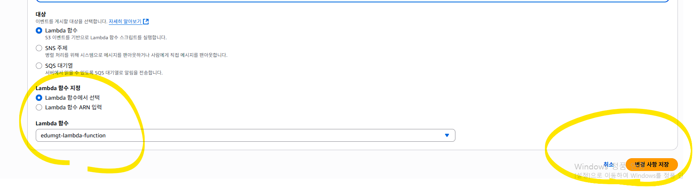
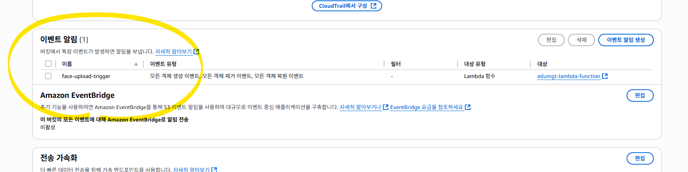

### Lambda 콘솔에서도 확인
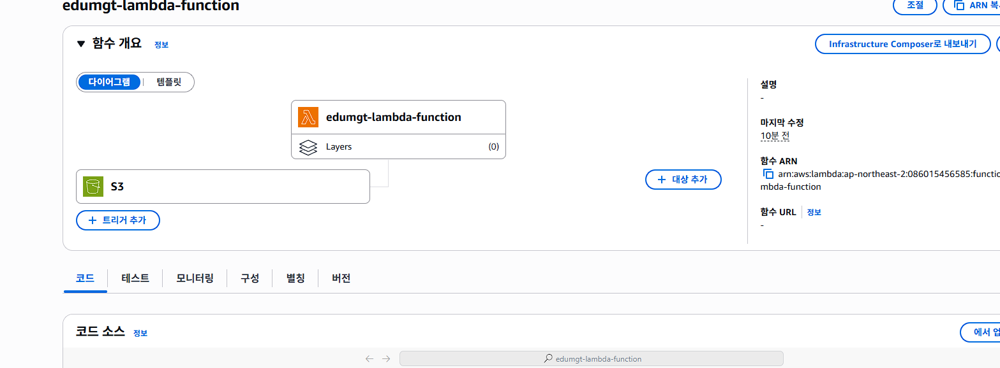
